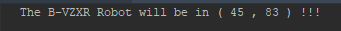

# B-VZXR
On s'intéresse à un système simplifié de lecture d'instructions par un petit robot téléguidé, nommé B-VZXR.  
Le but de l'exercice est de construire un programme qui lit une suite d'instruction et donne la position finale de B-VZXR.

## Requirements

* Python 3.7.0
* Pandas 1.1.4

## Installation
Le code source est disponible sur : https://github.com/pandas-dev/pandas

Pour installer pandas:

```sh
# conda
conda install pandas
```

```sh
# pip
pip install pandas
```

## Démarrage
Pour lancer le programe
 - Cloner le projet ou le telechaarger directement.
 - Executer directement le fichier get_final_position

```sh
python get_final_position.py
```

## Documentation
### L'univers du robot
B-VZXR vit dans un espace rectangulaire plat, comme un échiquier de taille n * p.
Chacune des n * p positions, ou cases, est définie par son abscisse et son ordonnée.
Le robot naît toujours sur la case en bas à gauche (ie. d'abscisse et d'ordonnée nulle), la tête vers le haut.
### Le langage du robot
Le petit robot ne comprend qu'un seul type d'instruction, qu'il lit de manière séquentielle.
Une instruction est composée de deux éléments :
Une chaîne de caractère : "right" ou "left"
Un nombre positif ou nul : 0, 1, 2…
Lorsque B-VZXR lit une instruction :
il va se tourner vers sa droite si la chaîne de caractère vaut "right", vers la gauche si elle vaut "left"
il va ensuite avancer de k cases selon la valeur du nombre
si il devait rencontrer un mur, il s'arrèterait d'avancer et lirait l'instruction suivante

## Resultat
Pour les fichier en input de ce projet on obtient :




## Scripts
#### scripts/get_final_position
Point d'entré du programe permetant de trouver la position finale du robot.

#### scripts/load_ressource
module responsable des chargement des fichiers de données nécessaire à l'execution.

#### scripts/robots_actions
module responsable de definir l'orientation du robot sur la carte et d'avancer par la suite dans le sens indiqué par les instructions.

### Resources
Repertoire contenant les fichiers texte universe et instruction_list.

### Test
Ce repertoire contient les differents test unitaire sur les differentes fonctions du projet
